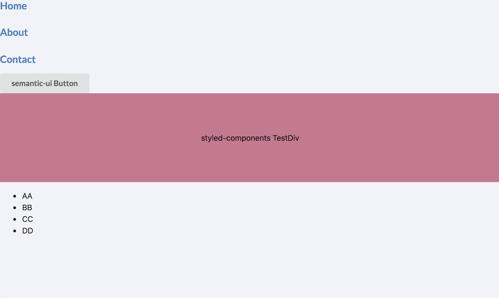

# react-starter

> A react starter kit with SSR.



## Installation

```
yarn global add create-razzle-app

git clone https://github.com/myungjaeyu/react-starter.git

cd react-starter

yarn install

yarn start
```

## Usage

1. production build `yarn build`

2. open the local server with the production file `yarn start:prod`

## Features

- Server-Side Rendering
- Razzle
- Sass
- React-router-dom v4+
- Redux-observable
- Preload / prefetch resource
- Code splitting
- Latest packages
- semantic-ui-react
- styled-components

Copyright © 2018 Liang Wang, Myungjae Yu

___

### Requirements

> | Vendor                | URL                                                   |
> |------------------------|------------------------------------------------------|
> | Razzle                 | https://github.com/jaredpalmer/razzle                |